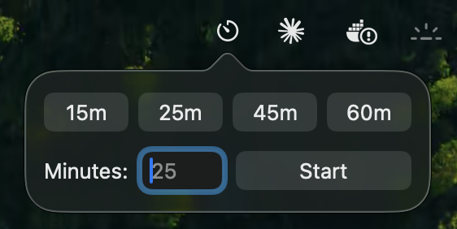

# Timebox

A macOS menu bar app that displays a visual progress bar along the top edge of the screen — works on all MacBooks, with or without a notch.

## Screenshots

*The popover — pick a preset or type any duration.*

*Early in the session — bar is green.*

*Nearing the end — bar shifts to red.*

## What it does

- Click the timer icon in the menu bar to open the popover
- Pick a preset duration (15 / 25 / 45 / 60 min) or type any number of minutes and hit **Start**
- A thin bar fills left-to-right across the top of your screen, shifting from green → yellow → red as time runs out — staying green for the first 70% of the session so urgency only ramps in the final stretch
- While a timer is running, reopening the popover shows the remaining time and lets you restart with a new duration or stop early (with a confirmation)
- On completion, the bar pulses 3 times in sync with haptic feedback through the trackpad
- A banner notification fires so you're covered even if you've looked away
- Launches at login automatically — no Dock icon, no Cmd+Tab entry

## Requirements

- macOS 26+ (Tahoe)
- Any MacBook (notch and non-notch models detected automatically)

## Setup

1. Open `Timebox.xcodeproj` in Xcode and press `⌘R` to build and run
2. The app appears as a timer icon in your menu bar — no Dock icon will appear
3. On first launch, approve the notification permission dialog when prompted
4. macOS will show a system notification confirming Timebox was added to Login Items — it will now open automatically on every login

To verify login item registration: **System Settings → General → Login Items & Extensions** — Timebox should appear under "Open at Login."

If you missed the notification permission dialog: **System Settings → Notifications → Timebox** and enable alerts with style set to **Banners**.

## Resource impact

Timebox is essentially dormant when no timer is running — no background loops, no polling. When a timer is active it runs a 20 Hz update loop to advance the progress bar, which is negligible (<0.1% CPU). Idle memory footprint is ~10 MB.

## Stack

Pure AppKit — no SwiftUI. `NSWindow` at `.screenSaver` level with a `CALayer` progress bar. `NSHapticFeedbackManager` for trackpad feedback. `UNUserNotificationCenter` for banner notifications. `SMAppService` for launch-at-login registration.
